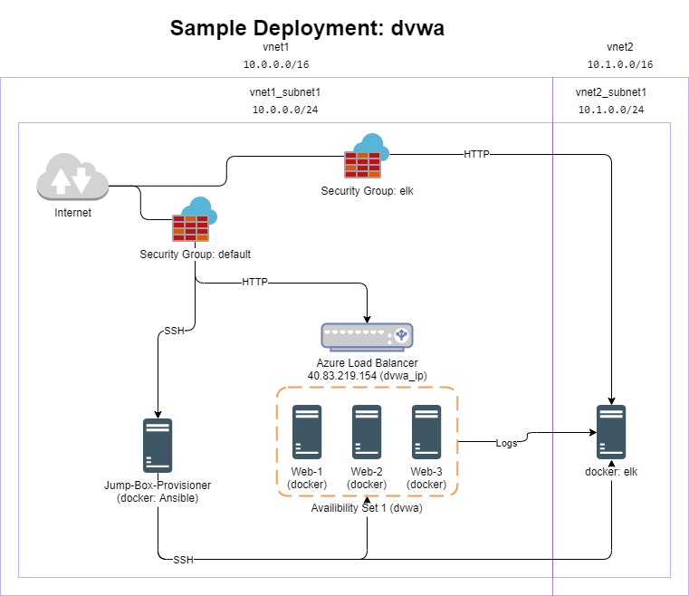

# Automated ELK Stack Deployment

The files in this repository were used to configure the network depicted below.



These files have been tested and used to generate a live ELK deployment on Azure. They can be used to recreate the deployment pictured above, or parts of it as needed.

This document contains the following details:

- Description of the Topology
- Access Policies
- ELK Configuration
  - Beats in Use
  - Machines Being Monitored
- How to Use the Ansible Build

## Prerequisites

Make sure of the following:

- Server provisioner and targets run Ubuntu 18.04+.
- The files under `ansible` must be installed in `/etc/ansible`.
- Server targets have a user `admin` with SSH key and `nopasswd` sudo.
  - Alternatively, edit the appropriate settings in `/etc/ansible`.
- The server running ELK must have at least 4GB RAM.
- The inventory (`/etc/ansible/hosts`) points to the appropriate hosts.

## Roles

This repository provides the following roles:

- `webservers`: The basic web application, installed as a Docker container.
- `elk`: A basic log analysis server.
- `filebeat`: Send system logs from `webservers` to `elk`.
- `metricbeat`: Send Docker metrics from `webservers` to `elk`.

## Description of the Topology

The purpose of this network is to expose a load-balanced and monitored instance of DVWA, the D*mn Vulnerable Web Application. Load balancing ensures that the application will be highly available.

Remote access to the network is restricted to a jump box. This allows us to monitor a single entry point for unauthorized access.

Integrating an ELK server allows users to easily monitor the vulnerable VMs for changes to the docker containers and system logs.

The configuration details of each machine may be found below.

| Name     | Function    | IP Address | Operating System |
|----------|-------------|------------|------------------|
| Jump Box | Provisioner | 10.0.0.2   | Linux            |
| Web-1    | Application | 10.0.0.5   | Linux            |
| Web-2    | Application | 10.0.0.6   | Linux            |
| ELK      | Analyzer    | 10.0.1.4   | Linux            |

## Access Policies

The machines on the internal network are not exposed to the public Internet.

Only the Jump Box machine can accept connections from the Internet. Only SSH access is permitted. Access to this machine is only allowed from the administrator's (my) public IP address.

Only the Jump Box can access machines on the local network. Kibana on the ELK server can only be accessed by tunnelling through the jump box (e.g. via `ssh -L`).

A summary of the access policies in place can be found in the table below.

| Name     | Publicly Accessible | Allowed IP Addresses |
|----------|---------------------|----------------------|
| Jump Box | Yes                 | (Admin's public IP)  |
| Web-*    | No                  | 10.0.0.2             |
| ELK      | No                  | 10.0.0.2             |

## Elk Configuration

The ELK machine is configured via Ansible. Only the Jump Box is configured manually; everything else is configured via Ansible. This provides several advantages:

- Scalability: Adding a new instance is easy; simply add the VM to the Ansible inventory.
- Reproducibility: New instances have almost the exact same state, making debugging easier.
- Version control: Describing the infrastructure as code makes it easy to make small, incremental changes or roll back problematic changes.

The ELK playbook implements the following tasks:

- Install prerequisites (docker, python, python3-docker)
- Tweak system parameters to improve ELK performance
- Download and install elk docker container.

To verify that ELK is running, SSH into the ELK machine and run `docker ps`. The output should look like this:

```text
# docker ps
CONTAINER ID        IMAGE               COMMAND                  CREATED             STATUS              PORTS                                                                              NAMES
4716e33d986f        sebp/elk:761        "/usr/local/bin/star…"   11 days ago         Up 42 seconds       0.0.0.0:5044->5044/tcp, 0.0.0.0:5601->5601/tcp, 0.0.0.0:9200->9200/tcp, 9300/tcp   elk
```

## Target Machines & Beats

This ELK server is configured to monitor the following machines:

- 10.0.0.4
- 10.0.0.5

Beats is installed on the above machines. These Beats allow us to collect the following information from each machine:

- `filebeat` collects system logs and other system file changes.
- `metricbeat` collects docker metrics.

## Using the Playbook

In order to use the playbook, you must have an Ansible control node.

- Clone this repository to the Ansible node.
- Copy the `ansible` directory to `/etc`:

  ```text
  cp -R ansible /etc
  ```

  - There should **NOT** be a folder `/etc/ansible/ansible` after copying.
- Update the `/etc/ansible/hosts` file to include your target machines.
- Run the playbook(s). There should be no errors or warnings. For example: `ansible-playbook -i /etc/ansible/hosts /etc/ansible/roles/elk.yml`

To check that ELK is running properly, run `curl -L <ELK IP>:5601` on the provisioner. If `curl` throws an error, check if the elk container is running, and start it if necessary. If `curl` returns empty text or reports that Kibana is still starting, try again in a few minutes.

Otherwise, if `curl` returns HTML text, you are good to go. You may navigate to `http://<ELK IP>:5601/app/kibana` in your browser to view the Kibana dashboard.
